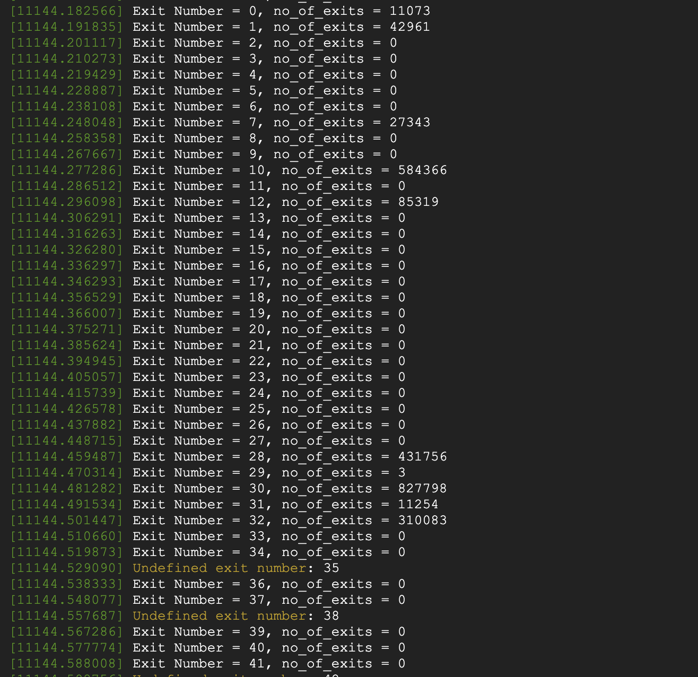
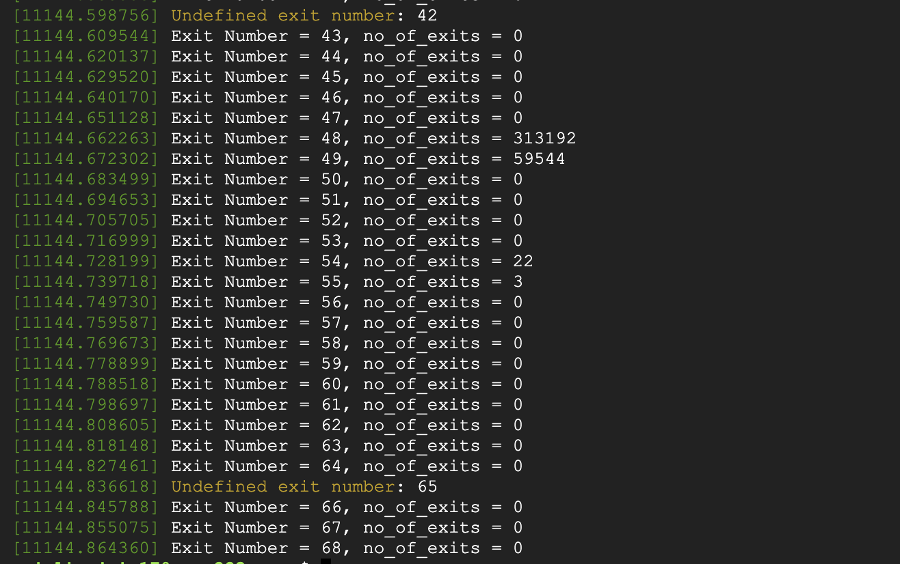
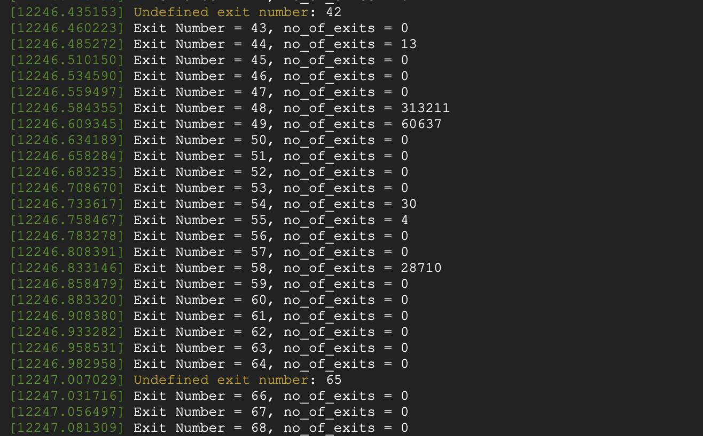

Team Member: Anjali Jain (015244151)

1. Did the assignment by myself.
2. Steps used to complete the assignment :
- Recorded total exit count information as done in assignment 3
- Shutdown inner vm
  - sudo virsh shutdown centOSvm
- Removed kvm_intel module
  - rmmod kvm-intel
- Reload the kvm-intel module with the parameter ept=0 
  - insmod  /lib/modules/5.18.0-rc3+/kernel/arch/x86/kvm/kvm-intel.ko ept=0
- Started inner vm again
  - sudo virsh start centOSvm
- Recorded total exit count information

## Exit count output from dmesg “with ept”
 
 

## Exit count output from dmesg "without ept"
 
 
 
### Questions :

#### What did you learn from the count of exits? Was the count what you expected? If not, why not?
- I observed that the count of exits increased significantly. This is what i had expected as shadow paging requires more number of exits to be performed so that it can function properly as VMM

#### What changed between the two runs (ept vs no-ept)?
- I observed increase in number of exits for NMI(0), External Interrupt(1), Interrupt Window(7), CPUID(10), IO Instruction(30), INVPCID(58), CR Access(28) among other exits.
