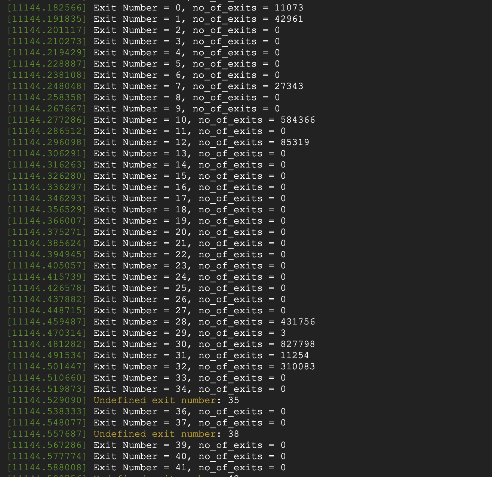
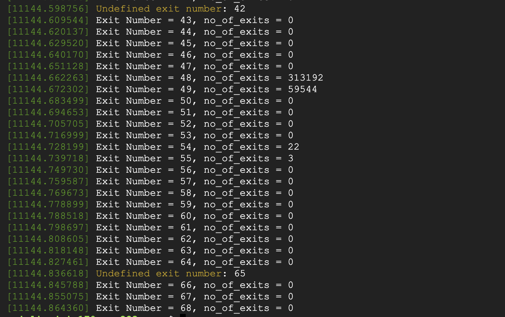
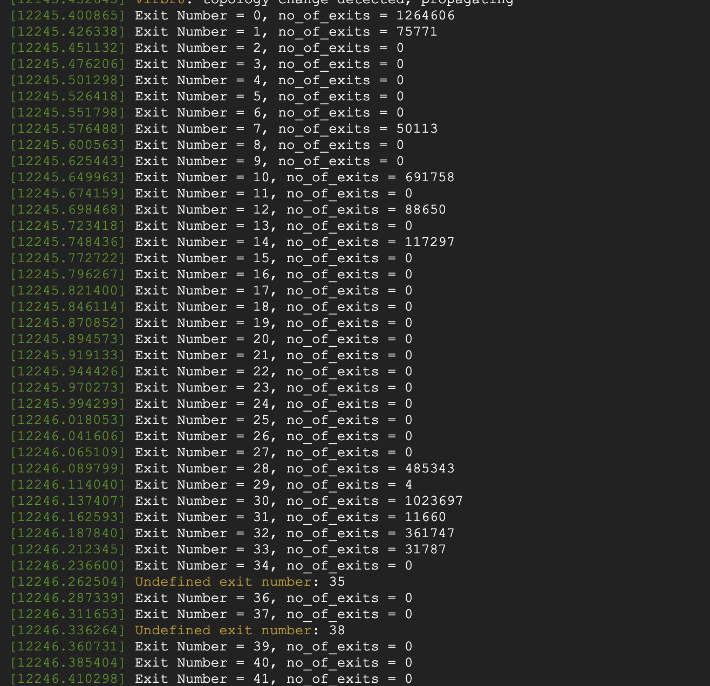
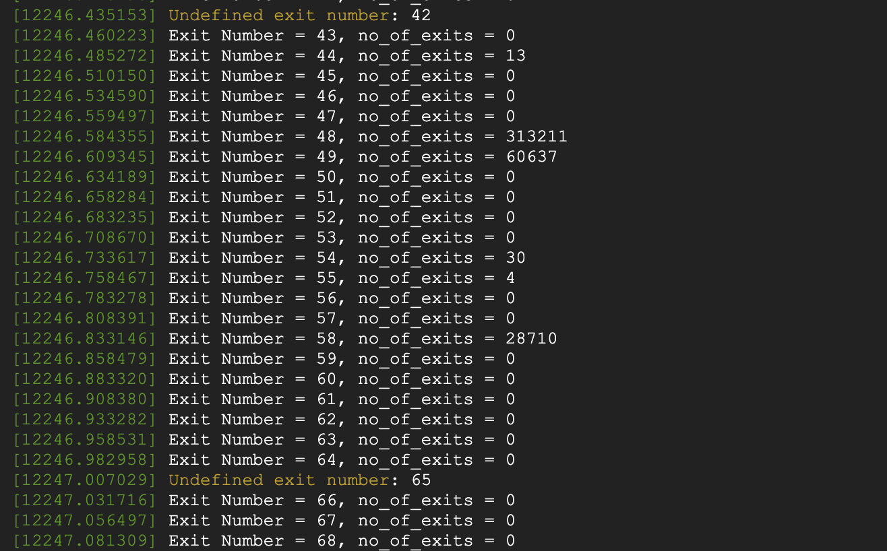
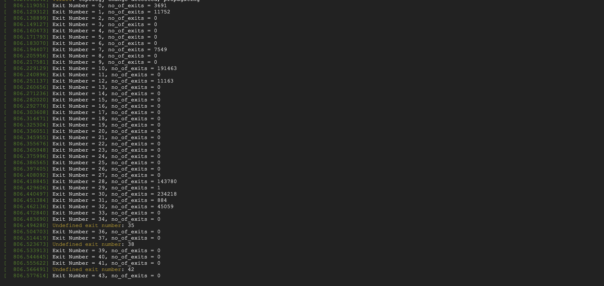
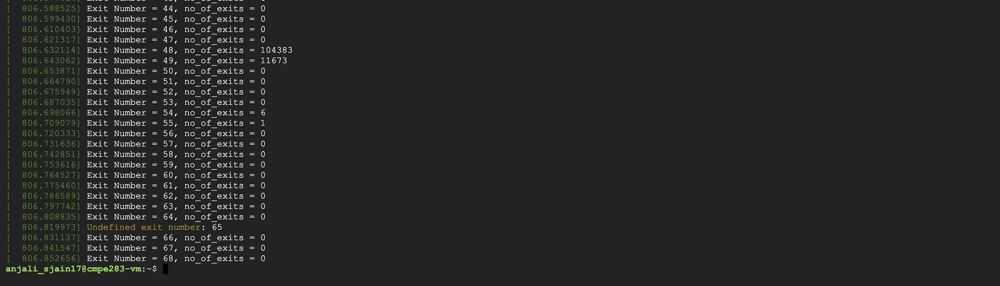
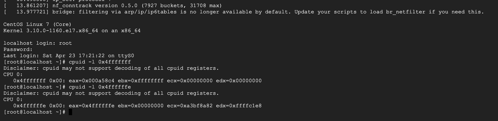
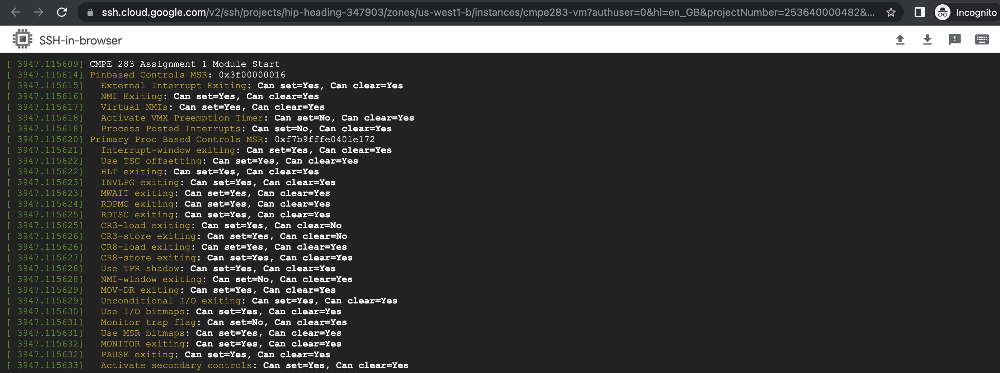
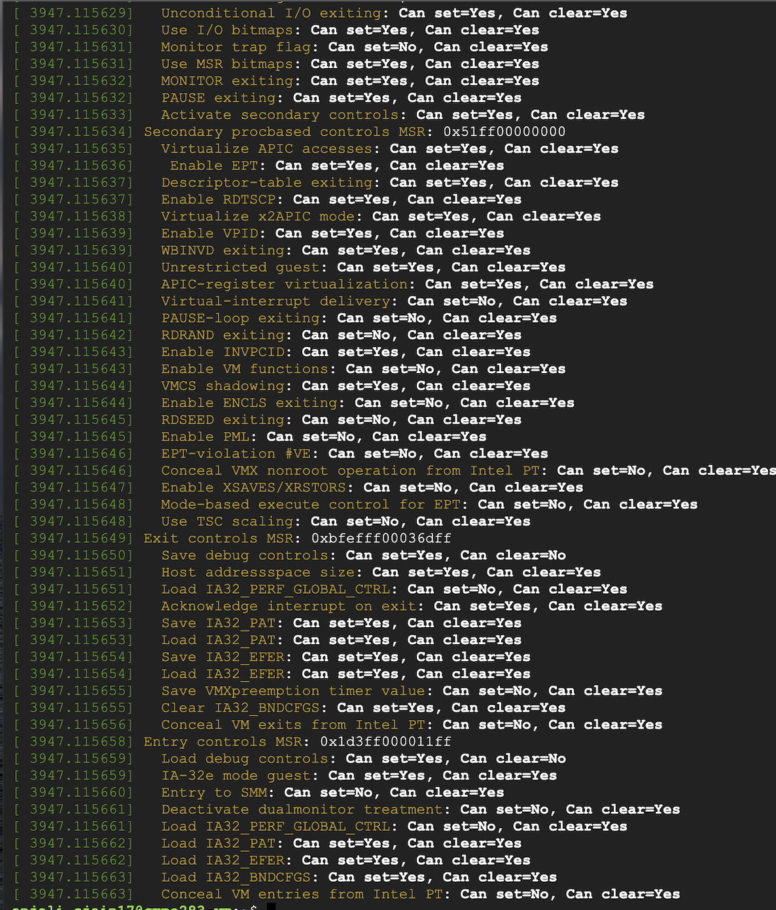

Assignment 4
=============
Team Member: Anjali Jain (015244151)

1. Did the assignment by myself.
2. Steps used to complete the assignment :
- Recorded total exit count information as done in assignment 3
- Shutdown inner vm
  - sudo virsh shutdown centOSvm
- Removed kvm_intel module
  - rmmod kvm-intel
- Reload the kvm-intel module with the parameter ept=0 
  - insmod  /lib/modules/5.18.0-rc3+/kernel/arch/x86/kvm/kvm-intel.ko ept=0
- Started inner vm again
  - sudo virsh start centOSvm
- Recorded total exit count information

## Exit count output from dmesg “with ept”
 
 

## Exit count output from dmesg "without ept"
 
 
 
### Questions :

#### What did you learn from the count of exits? Was the count what you expected? If not, why not?
- I observed that the count of exits increased significantly. This is what i had expected as shadow paging requires more number of exits to be performed so that it can function properly as VMM

#### What changed between the two runs (ept vs no-ept)?
- I observed increase in number of exits for NMI(0) from 11073 to 1264606, External Interrupt(1), Interrupt Window(7), CPUID(10), IO Instruction(30), INVPCID(58), CR Access(28) among other exits. 

Assignment 3
=============
Team Member: Anjali Jain (015244151)

1. Did the assignment by myself.
2. Steps used to complete the assignment :
- Added code in cpuid.c and vmx.c to implement the functionality for eax= 0x4FFFFFFD and 0x4FFFFFFC(as required in the question)
- make -j 8 modules
- sudo bash
- make INSTALL_MOD_STRIP=1 modules_install && make install
- lsmod | grep kvm
- rmmod kvm_intel
- rmmod kvm
- modprobe kvm
- modprobe kvm_intel
- lsmod | grep kvm

3. Login into the inner vm
  - sudo virsh start centOSvm
  - sudo virsh console centOSvm

4. -Run the below commands:
  -  for i in seq 0 69 ; do cpuid -l 0x4ffffffd -s $i; done
  ### screenshot of output 
  
  
  
### Questions : 
#### Comment on the frequency of exits – does the number of exits increase at a stable rate? Or are there more exits performed during certain VM operations? Approximately how many exits does a full VM boot entail?

- No, the number of exists do not increase at a stable rate. More exits are performed during operation suchas MSR access, IO instructions and EPT violation. Total number of exits on full VM boot is 1571144.

#### Of the exit types defined in the SDM, which are the most frequent? Least?
- I observed that most frequenct exits are related to EPT Violation(48), EPT Misconfiguration(49), MSR access(32), CPUID(10),HLT(12),IO Instruction(30) and Interrupt Window(7). The least frequent exits are related to VMWRITE, VMXON, VMXOFF,VM-entry failure due to machine-check event amongs other exits.

Assignment 2
=============

Team Member: Anjali Jain (015244151)

1. Did the assignment by myself.
2. Steps used to complete the assignment :
- Used the setup from assignment 1
- Added code in cpuid.c and vmx.c to implement the functionality for eax= 0x4FFFFFFF and 0x4FFFFFFE(as required in the question)
- make -j 8 modules
- sudo bash
- make INSTALL_MOD_STRIP=1 modules_install && make install
- lsmod | grep kvm
- rmmod kvm_intel
- rmmod kvm
- modprobe kvm
- modprobe kvm_intel
- lsmod | grep kvm
3. Steps used for testing
- Download inner virtual machine  image of CentOS distribution image using below commands:
  - wget http://mirror.math.princeton.edu/pub/centos/7.9.2009/isos/x86_64/CentOS-7-x86_64-DVD-2009.iso
- Install the packages
  - sudo apt-get install qemu-kvm libvirt-daemon-system libvirt-clients bridge-utils
- Install the downloaded virtual machine image
  - virt-install  --network bridge:virbr0 --name centOSvm --os-variant=centos7.0 --ram=1024 --vcpus=1 --disk path=/var/lib/libvirt/images/centOSvm-os.qcow2,format=qcow2,bus=virtio,size=5 --graphics none  --location=CentOS-7-x86_64-DVD-2009.iso --extra-args="console=tty0 console=ttyS0,115200"  --check all=off
- Login into the inner vm
  - sudo virsh start centOSvm
  - sudo virsh console centOSvm

-Install cpuid in inner VM
  - sudo yum -y install cpuid

-Run the below commands
  - cpuid -l 0x4fffffff 
  - cpuid -l 0x4ffffffe
  ### screenshot of output 
  
  
Assignment 1
=============

Team Member: Anjali Jain (015244151)

1. Did the assignment by myself.
2. Steps used to complete the assignment :
- Setup VMX enabled VM instance on GCP.
- Download cmpe283.c file and MakeFile (as provided by professor Mike Larkin).
- Make the code changes as required in the assignment and upload above two files to GCP VM instance.
- Fork and clone linux repository (master branch)
- Navigate to Linux directory(where the source code is cloned) and run the below commands :
  - make menuconfig
  - make oldconfig (press enter for the selecting the default answers)
  - make prepare
  - make -j 8 modules
  - make -j 8 
  - sudo make INSTALL_MOD_STRIP=1 modules_install
  - sudo make install (installs module)
  - sudo reboot (reboots to apply the changes of the latest version of kernal)
  - uname -a (should reflect the latest version of the kernal)
- While following the above step,install all the missing packages i.e git, make, gcc, build-essential, sslclient etc to successfully build the kernal module.
- Run the "make" command. There will be an error of missing module license. Open the cmpe283-1.c file and add (MODULE_LICENSE("GPL v2");) at the end of the file and save the changes
- Execute the make command again.After it is successfully executed, check that the .ko file is created using "lsmod | grep cmpe283"
- Insert module using sudo insmod cmpe283-1.ko
- To Unload a module use (sudo rmmmod cmpe283-1)
- run "dmesg" command to see the output of the code
- Commit & push the changes to git using below commands
  - git add
  - git commit -m "This is assignment1 of CMPE283"
  - git push
Output:
### Screenshot 1

### Screenshot 2

